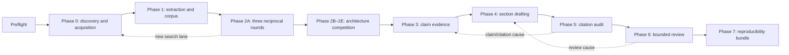

# Architecture

## Why a composite product

A prompt alone cannot guarantee durable resume, provenance, safe file boundaries, recursive invalidation, or deterministic gates. A large MCP server should not be the scientific reasoning brain. Review Workflow Codex therefore separates four responsibilities:

1. The Codex Skill explains scientific workflow, questioning, evidence ceilings, and when to use tools.
2. The local MCP exposes bounded typed actions, never an unrestricted shell or file primitive.
3. The Python harness owns state, hashes, artifacts, return rules, privacy decisions, and adapters.
4. The generated workspace owns all durable project knowledge; chat history and long-context memory services are not canonical storage.

This design does not require Engramory, llm-wiki, Headcone, PaperQA2, or Co-STORM. Those may be evaluated later as optional adapters, but v0.1 avoids adding privacy, licensing, cost, and reproducibility surface before evidence shows a need.

## Phase and loop model

Phase 2A has at least three reciprocal rounds. In each round Codex asks 3–5 questions and the operator asks 3–5 questions. The required scope brief covers readers, reader decision, inclusion/exclusion, nearest reviews, distinction, unresolved problem, contribution, evidence feasibility, review type, and publication mode.

The harness prevents entry to Phase 2B until three rounds are recorded. If a round produces a new search lane, `state.json` moves to Phase 0 before the search begins and retains the exact Phase 2A resume action. Discovery gives all two or three recommendations an acquisition request. A licensed open URL is downloaded automatically; missing or legally uncertain full text becomes `WAITING_ACQUISITION` for operator supply or a reasoned dismissal. When the last request is resolved, acquisition files are deduplicated and merged with the existing manifest, reused or extracted, and added to the FTS corpus. The workflow then enters `WAITING_USER` for reading notes; only `recommended_reading_acknowledge` restores the saved action.

Phase 2 architecture scores use 20/25/20/15/10/5/5 weights for reader value, differentiation, unresolved value, synthesis utility, evidence feasibility, newcomer accessibility, and publication fit. Non-compensable thresholds prevent a polished but generic outline from winning.

## Human checkpoints

The mandatory gates are:

- Phase 2E: scope, positioning, architecture, alternatives, and risks;
- Phase 5: semantic citation audit and windows-lite manual checks;
- Phase 6: reviewer findings, dispositions, and remaining limitations;
- Phase 7: final manuscript and migration/reproducibility bundle.

`WAITING_USER` and `WAITING_ACQUISITION` are explicit waits, not approval gates. After a valid answer, the workflow follows the saved resume action and automatically continues in the same active Codex task until the next real wait, failure, pause, gate, or completion.

## Returns are not a separate rework phase

Missing literature returns to Phase 0; identity/extraction problems to Phase 1; positioning problems to Phase 2; claim support to Phase 3; prose/visual problems to Phase 4; semantic citation defects to their causal Phase 3–5; and review defects to their causal Phase 4–6.

Each return stores the prior hashes of changed artifacts and the exact origin action. Resume is blocked until changed artifacts have new hashes, every invalidated descendant has been replaced, and a substantive resolution record cites fresh, hash-valid evidence artifacts whose kinds match the failure's stop condition. Unrelated artifacts remain reusable.

## Local extraction and search

Sources receive IDs from their SHA-256 content. Extraction IDs include source hash, parser, parser version, parser configuration, and schema version. Full identities remain in records; shortened physical directory keys avoid legacy Windows path-length failure. Derived SQLite FTS indexes can be rebuilt from immutable extraction records.

MarkItDown is a lightweight PDF/DOCX fallback, python-docx preserves draft headings/tables, pypdf preserves page locators, Docling is the layout-aware PDF option, and GROBID produces separately versioned TEI in the `full` profile. Parser failure or degraded capability is recorded rather than hidden.

## Supported output claims

The product supports narrative, critical, and technical reviews. It rejects systematic review and meta-analysis labeling because it does not supply formal protocol registration, independent dual screening, risk-of-bias methodology, or quantitative pooling.
